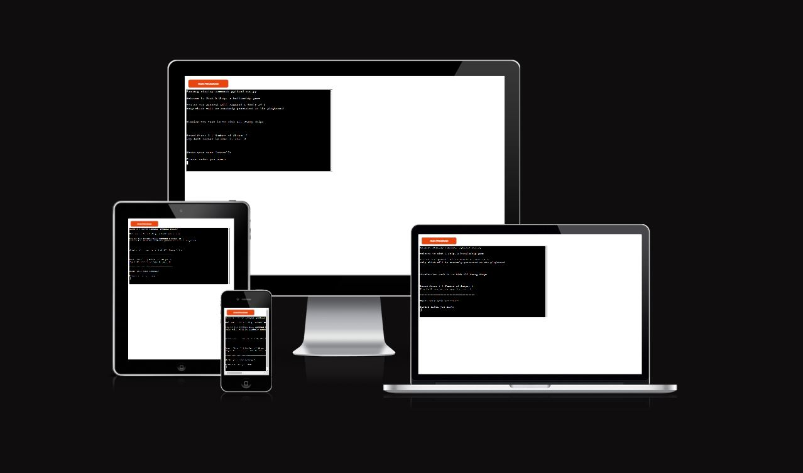
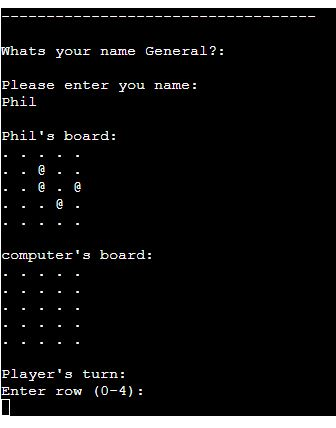
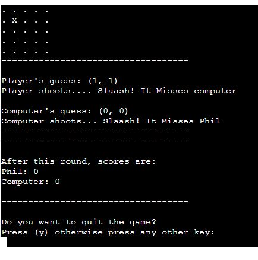
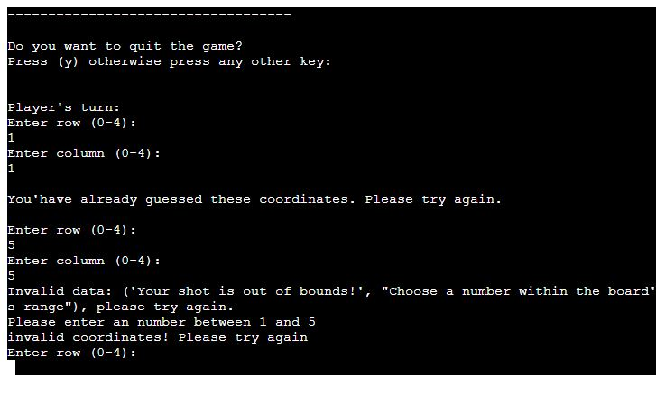

# Sink A Ship

Sink A Ship is a battleship game playid in Python terminal. It runs with the Code Institute mock terminal on Heroku.

The user will win if they manage to find all the computers battleships, this has to be done before the computer finds theirs. 

[Here is the live version](https://sink-a-ship-283abb4062a9.herokuapp.com/)

## How to play

Sink a ship is based on the classic game battleship. 

In this version, the user will receive a short "mission" objective which is to sink enemy ships. There after player will get ask for their name. Two boards are then generated.

The users ships are indicated by an @ sign and the computers ships are hidden, which the user cannot see.

The guesses made are marked on the board with an x. Hits are indicated by *.

The player and computer then takes turns to make guesses and try to sink each other's battleships.

The winner is the player who sinks all their opponent's battleships first.

## Features

### Existing features

* Random board generation
  * Ships are randomly placed on both of the player and computer boards.
  * User cannot see where computers ships are.

 

  * Play against the computer 
  * Accepts user input
  * Maintains scores

 

* Input validation and error-checking
  * Entering coordinates outside the board grids promt an error message.
  * Only numbers are accepted.
  * Entering the same guesses twice will not be accepted.

 

 * Data maintained in  class instances.
  

### Features left to Implement

*  Allow player to choose choose board size and amount of ships.
*  Allow players to place their own ships by inputing coordinates.

## Data Model

Saw a video from an instructure that they use a class model to hold the board size, number of ships, position of ships, the guesses and details as the boar type.

I decided to impliment the same and it was a good decision cause it make it eaiser to run it from Board class. 

Through the Board class i created methods as guess, add ships and print board.

## Testing 

I have manually tested this project by doing the following:

* Passed the code through a PEP8 linter and confirmed there are no errors.
* Given invalid inputs: strings when numbers are expected, out of bounds inputs, same input twice
* Tested in my local terminal and the Code Institue Heroku terminal
* Check that there is always four randomly generated ships.

## Bugs

Solved bugs

* When populating the board keept getting this error prompt. It was due to that i dint not print out the board on sceen

* Had issues with getting the board names to show after each round, i just had to move it by the end of the code in run_game function.

## Remaining Bugs

*  No bugs remaining 

## Validator Testin

* PEP8
  * No errors where returned

 ## Deployment 

 This project was deployed using Code institute's mock terminal for Heroku.

 * Steps for deployment:
   * Create a new Heroku app
   * Link the Heroku app to the repository.
   * Click on Deplo

  The live link to this page - [In Three](https://maadajibao.github.io/Project-2-In-Three/)

## Credits

* Code institute for the deployment terminal
* Code institute for the basice setup of the idea 
* Code institute for the idea of classes

